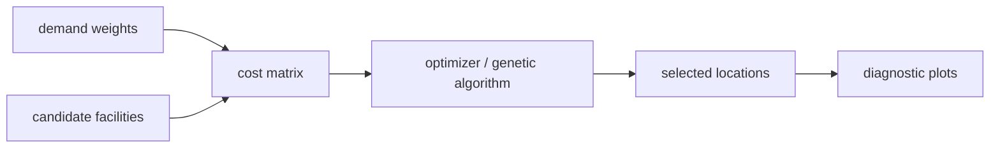
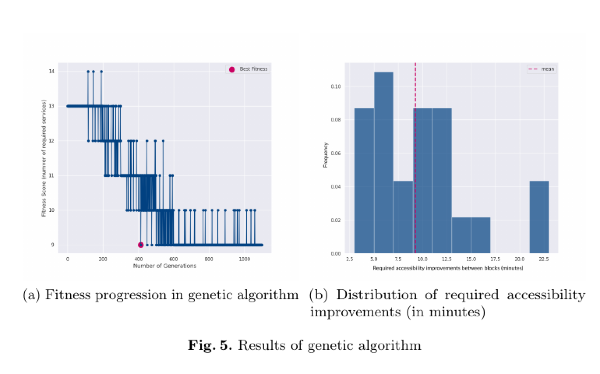

# solver_flp

Facility-location problem solver for exact and genetic service-placement experiments.

## System Map



## Main Result



## Run

Entrypoint: `examples/using_example.ipynb`

Human:

```bash
pip install -e . && jupyter notebook examples/using_example.ipynb
```

Agent: state the mode explicitly: exact/non-genetic or genetic, and whether the scenario expands existing services or opens new ones.

## Publication

Related dissertation publication bundle is in the parent thesis submodule. The README result image is copied from the dissertation figure set.

## Next Steps / Heuristics

Heuristic: use exact mode for small sanity checks before GA runs. Report unmet demand from the actual output field used by the current pipeline.
